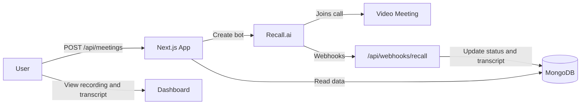

# Meeting Bot

A Next.js app that sends an AI notetaker bot into video meetings, records calls, stores transcripts in MongoDB, and provides a dashboard to review recordings and meeting details.

## Features

- **Google sign-in** via NextAuth
- **Meeting bot deployment** to Google Meet, Zoom, or Microsoft Teams through [Recall.ai](https://www.recall.ai/)
- **Live status tracking** — requested, joining, in call, recording, done, failed
- **Transcripts** with speaker labels and timestamps
- **Meeting detail page** with video playback, transcript panel, participants, and export
- **User settings** — bot name, recording preferences, integrations, and notifications
- **Webhook-driven updates** from Recall for recording and transcript completion

## Tech Stack

| Layer | Tools |
|---|---|
| Frontend | Next.js 16, React 19, Tailwind CSS 4, shadcn/ui |
| Auth | NextAuth (Google OAuth) |
| Database | MongoDB Atlas, Mongoose |
| Bot / Recording | Recall.ai API |
| Webhooks | Svix signature verification |

## Prerequisites

- Node.js 20+
- MongoDB Atlas cluster
- Google OAuth credentials
- Recall.ai API key and webhook secret

## Getting Started

### 1. Clone and install

```bash
git clone https://github.com/Shivam29-03/Meeting-Bot.git
cd Meeting-Bot
npm install
```

### 2. Environment variables

Create a `.env.local` file in the project root:

```env
# App
NEXTAUTH_URL=http://localhost:3000
NEXTAUTH_SECRET=your-nextauth-secret
NEXT_PUBLIC_API_URL=http://localhost:3000

# Google OAuth
GOOGLE_CLIENT_ID=your-google-client-id
GOOGLE_CLIENT_SECRET=your-google-client-secret

# MongoDB Atlas
MONGODB_URI=mongodb+srv://<user>:<password>@<cluster>.mongodb.net/

# Optional: use a standard connection string if SRV DNS fails on your network
# MONGODB_URI_STANDARD=mongodb://<user>:<password>@host1:27017,host2:27017,host3:27017/meetingbot?ssl=true&authSource=admin&replicaSet=...

# Recall.ai
RECALL_API=your-recall-api-key
RECALL_REGION=ap-northeast-1
RECALL_WEBHOOK_SECRET=whsec_your_webhook_secret

# Local webhook tunnel (e.g. ngrok)
WEBHOOK_URL=https://your-tunnel-url.ngrok-free.dev
```

Generate `NEXTAUTH_SECRET`:

```bash
openssl rand -base64 32
```

### 3. MongoDB Atlas setup

1. Create a free cluster on [MongoDB Atlas](https://www.cloud.mongodb.com/).
2. Add your IP under **Network Access** (or `0.0.0.0/0` for local development).
3. Create a database user and copy the connection string into `MONGODB_URI`.

The app stores data in the `meetingbot` database across three collections:

- `meetings` — bot sessions, status, recording metadata
- `meeting_transcripts` — transcript segments per meeting
- `user_settings` — per-user preferences

> **Windows note:** If `mongodb+srv://` fails due to DNS, the app automatically resolves Atlas hosts via public DNS and connects using a replica-set URI. You can also set `MONGODB_URI_STANDARD` manually.

### 4. Recall.ai setup

1. Create an account and get your API key from the [Recall dashboard](https://www.recall.ai/).
2. Set `RECALL_REGION` to your Recall region (e.g. `ap-northeast-1`, `us-west-2`).
3. Register a webhook pointing to:

   ```
   https://<your-domain>/api/webhooks/recall
   ```

4. For local development, expose your app with [ngrok](https://ngrok.com/) and set `WEBHOOK_URL` accordingly.

### 5. Run the dev server

```bash
npm run dev
```

Open [http://localhost:3000](http://localhost:3000), sign in with Google, and start a meeting from the dashboard.

## Scripts

| Command | Description |
|---|---|
| `npm run dev` | Start development server |
| `npm run build` | Production build |
| `npm run start` | Start production server |
| `npm run lint` | Run ESLint |

## Project Structure

```
src/
├── app/
│   ├── api/
│   │   ├── auth/[...nextauth]/   # NextAuth routes
│   │   ├── meetings/             # CRUD + video download
│   │   ├── settings/             # User settings API
│   │   └── webhooks/recall/      # Recall webhook handler
│   ├── dashboard/                # Dashboard, meetings, settings, profile
│   └── login/                    # Sign-in page
├── components/                   # UI components
├── lib/                          # Business logic, DB, Recall client
├── models/                       # Mongoose schemas
├── services/                     # Client-side API helpers
└── hooks/                        # React hooks
```

## API Routes

| Method | Route | Description |
|---|---|---|
| `GET` | `/api/meetings` | List meetings for the signed-in user |
| `POST` | `/api/meetings` | Create a meeting and deploy a Recall bot |
| `GET` | `/api/meetings/[id]` | Get meeting details |
| `DELETE` | `/api/meetings/[id]` | Delete a meeting and its Recall bot |
| `GET` | `/api/meetings/[id]/video` | Download meeting recording |
| `GET` | `/api/settings` | Get user settings |
| `PUT` | `/api/settings` | Save user settings |
| `POST` | `/api/webhooks/recall` | Recall.ai webhook endpoint |

## Meeting Flow



## Deployment

Deploy to [Vercel](https://vercel.com/) or any Node.js host that supports Next.js App Router. Set all environment variables in your hosting provider and update:

- `NEXTAUTH_URL` to your production URL
- Recall webhook URL to `https://<your-domain>/api/webhooks/recall`
- MongoDB Atlas network access for your deployment IP

## License

Private project.
