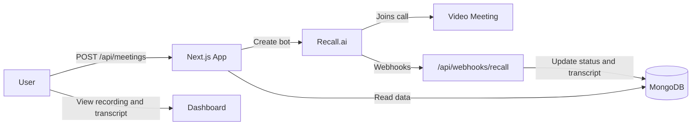

# Meeting Bot

A Next.js app that sends an AI notetaker bot into video meetings, records calls, stores transcripts in MongoDB, and provides a dashboard to review recordings and meeting details.

## Features

- **Google sign-in** via NextAuth
- **Meeting bot deployment** to Google Meet, Zoom, or Microsoft Teams through [Recall.ai](https://www.recall.ai/)
- **Live status tracking** — requested, joining, in call, recording, done, failed
- **Paginated meeting history** with cursor-based "Load more" on the meetings page
- **Active recording limit** — up to 3 concurrent recordings per user
- **Platform URL validation** — only supported meeting links are accepted before a bot is created
- **Transcripts** with speaker labels and timestamps
- **Meeting detail page** with video playback, transcript panel, participants, and export
- **Actionable failure messages** — specific errors when a bot is blocked, login is required, or recording is denied
- **User settings** — bot name, recording preferences, integrations, and notifications
- **Webhook-driven updates** from Recall with Svix signature verification
- **Gallery-view recordings** — mixed MP4 uses Recall's `gallery_view_v2` layout for multi-participant meetings

## Tech Stack

| Layer | Tools |
|---|---|
| Frontend | Next.js 16, React 19, Tailwind CSS 4, shadcn/ui |
| Auth | NextAuth (Google OAuth) |
| Database | MongoDB Atlas, Mongoose |
| Bot / Recording | Recall.ai API |
| Webhooks | Svix signature verification |

## Prerequisites

- Node.js 20+
- MongoDB Atlas cluster
- Google OAuth credentials
- Recall.ai API key and webhook secret

## Getting Started

### 1. Clone and install

```bash
git clone https://github.com/Shivam29-03/Meeting-Bot.git
cd Meeting-Bot
npm install
```

### 2. Environment variables

Create a `.env.local` file in the project root:

```env
# App
NEXTAUTH_URL=http://localhost:3000
NEXTAUTH_SECRET=your-nextauth-secret
NEXT_PUBLIC_API_URL=http://localhost:3000

# Google OAuth
GOOGLE_CLIENT_ID=your-google-client-id
GOOGLE_CLIENT_SECRET=your-google-client-secret

# MongoDB Atlas
MONGODB_URI=mongodb+srv://<user>:<password>@<cluster>.mongodb.net/

# Optional: standard connection string for production or when SRV DNS fails
# MONGODB_URI_STANDARD=mongodb://<user>:<password>@host1:27017,host2:27017,host3:27017/meetingbot?ssl=true&authSource=admin&replicaSet=...

# Recall.ai
RECALL_API=your-recall-api-key
RECALL_REGION=ap-northeast-1
RECALL_WEBHOOK_SECRET=whsec_your_webhook_secret
```

Generate `NEXTAUTH_SECRET`:

```bash
openssl rand -base64 32
```

### 3. MongoDB Atlas setup

1. Create a free cluster on [MongoDB Atlas](https://www.cloud.mongodb.com/).
2. Add your IP under **Network Access** (or `0.0.0.0/0` for local development).
3. Create a database user and copy the connection string into `MONGODB_URI`.

The app stores data in the `meetingbot` database across three collections:

- `meetings` — bot sessions, status, recording metadata, failure sub-codes
- `meeting_transcripts` — transcript segments per meeting
- `user_settings` — per-user preferences

> **Windows note:** If `mongodb+srv://` fails due to DNS in development, the app automatically resolves Atlas hosts via public DNS and connects using a replica-set URI. You can also set `MONGODB_URI_STANDARD` manually.
>
> **Production note:** In production (`NODE_ENV=production`), the app prefers `MONGODB_URI_STANDARD` when set, and skips the SRV DNS fallback. Set this on Vercel or other hosts where SRV resolution is unreliable.

### 4. Recall.ai setup

1. Create an account and get your API key from the [Recall dashboard](https://www.recall.ai/).
2. Set `RECALL_REGION` to your Recall region (e.g. `ap-northeast-1`, `us-west-2`).
3. Register a webhook pointing to:

   ```
   https://<your-domain>/api/webhooks/recall
   ```

   Copy the webhook signing secret into `RECALL_WEBHOOK_SECRET`. Signature verification is always required — use a real `whsec_...` value even for local development.

4. For local development, expose your app with [ngrok](https://ngrok.com/) (or similar) and register the tunnel URL as the webhook endpoint in the Recall dashboard.

### 5. Run the dev server

```bash
npm run dev
```

Open [http://localhost:3000](http://localhost:3000), sign in with Google, and start a meeting from the dashboard.

## Scripts

| Command | Description |
|---|---|
| `npm run dev` | Start development server |
| `npm run build` | Production build |
| `npm run start` | Start production server |
| `npm run lint` | Run ESLint |

## Project Structure

```
src/
├── app/
│   ├── api/
│   │   ├── auth/[...nextauth]/   # NextAuth routes
│   │   ├── meetings/             # CRUD, pagination, video download
│   │   ├── settings/             # User settings API
│   │   └── webhooks/recall/      # Recall webhook handler
│   ├── dashboard/                # Dashboard, meetings, settings, profile
│   └── login/                    # Sign-in page
├── components/                   # UI components
├── lib/                          # Business logic, DB, Recall client
├── models/                       # Mongoose schemas
├── services/                     # Client-side API helpers
└── hooks/                        # React hooks (e.g. meeting status polling)
```

## API Routes

| Method | Route | Description |
|---|---|---|
| `GET` | `/api/meetings` | List meetings for the signed-in user (supports pagination) |
| `POST` | `/api/meetings` | Create a meeting and deploy a Recall bot |
| `GET` | `/api/meetings/[id]` | Get meeting details |
| `DELETE` | `/api/meetings/[id]` | Delete a meeting and its Recall bot |
| `GET` | `/api/meetings/[id]/video` | Stream meeting recording download |
| `GET` | `/api/settings` | Get user settings |
| `PUT` | `/api/settings` | Save user settings |
| `POST` | `/api/webhooks/recall` | Recall.ai webhook endpoint |

### `GET /api/meetings` query parameters

| Parameter | Type | Description |
|---|---|---|
| `limit` | number | Page size (1–100, default 50) |
| `cursor` | ISO date string | Return meetings created before this timestamp |

### `POST /api/meetings` constraints

- **Supported platforms:** `meet.google.com`, `zoom.us`, `*.zoom.us`, `teams.microsoft.com`, `teams.live.com`
- **Active limit:** Returns `429` if the user already has 3 recordings in progress (`requested`, `joining`, `in_call`, or `recording`)

## Meeting Flow



## Reliability

- **Webhook verification** — all Recall webhooks are verified with Svix before processing
- **Terminal status protection** — meetings marked `done` or `failed` are not downgraded by late or out-of-order events
- **Orphan bot cleanup** — if database insert fails after bot creation, the Recall bot is deleted
- **Throttled status sync** — active meetings are synced from Recall at most once every 30 seconds during list requests
- **Streamed video downloads** — recordings are proxied without buffering the full file in memory

## Deployment

This repository is configured for production deployment to **Google Cloud Run** from **GitHub Actions**. Images are built with Docker Buildx, pushed to **Artifact Registry** as `latest`, and deployed with `gcloud run deploy`.

### Deployment files

| Path | Purpose |
|---|---|
| `Dockerfile` | Multi-stage Alpine production image for Next.js standalone output |
| `.dockerignore` | Keeps local env files, dependencies, build output, and generated credentials out of the image context |
| `.github/workflows/deploy-clienthf.yml` | ClientHF Cloud Run deployment |
| `.github/workflows/deploy-dev-app.yml` | Dev Cloud Run deployment |
| `.github/workflows/deploy-dev2.yml` | Dev2 Cloud Run deployment |
| `.github/workflows/deploy-metawurks-prod-app.yml` | Metawurks production Cloud Run deployment |
| `.github/workflows/deploy-pre-prod-app.yml` | Pre-prod Cloud Run deployment |
| `.github/workflows/deploy-privatetwo.yml` | Privatetwo Cloud Run deployment |
| `.github/workflows/deploy-prod-app.yml` | Production Cloud Run deployment |
| `deploy-to-artifact-registry.sh` | Local Bash helper for building, pushing, and deploying a selected environment |
| `.env.example` | Local environment variable template |

### Google Cloud resources

The environment workflows follow the Metawurks project layout and deploy to `us-central1`.

Required APIs:

```bash
gcloud services enable \
  artifactregistry.googleapis.com \
  run.googleapis.com \
  secretmanager.googleapis.com \
  iamcredentials.googleapis.com
```

Recommended service account permissions:

| Service account | Used by | Minimum recommended roles |
|---|---|---|
| Deployment service account from `GCP_SA_KEY*` | GitHub Actions deployment | `roles/run.admin`, `roles/artifactregistry.writer`, `roles/iam.serviceAccountUser` on the runtime service account |
| Environment runtime service account | Cloud Run service runtime identity | `roles/secretmanager.secretAccessor` |

Any workflow that creates repositories or enables APIs also needs `roles/serviceusage.serviceUsageAdmin` and `roles/artifactregistry.admin`, or those resources can be created once by an administrator.

### Artifact Registry

Each workflow pushes to its environment-specific Artifact Registry repository. Example:

```bash
gcloud artifacts repositories create dev-meeting-bot \
  --repository-format=docker \
  --location=us-central1 \
  --description="Meeting Bot production container images"
```

### GitHub configuration

Environment workflows:

| Workflow | Project | Repository | Service | GitHub secret |
|---|---|---|---|---|
| `deploy-dev-app.yml` | `metawurks-dev-preprod` | `dev-meeting-bot` | `dev-meeting-bot` | `GCP_SA_KEY` |
| `deploy-dev2.yml` | `metawurks-dev-preprod` | `dev2-meeting-bot` | `dev2-meeting-bot` | `GCP_SA_KEY_DEV2` |
| `deploy-pre-prod-app.yml` | `metawurks-dev-preprod` | `pre-prod-meeting-bot` | `pre-prod-meeting-bot` | `GCP_SA_KEY_PREPROD` |
| `deploy-prod-app.yml` | `metawurks` | `prod-meeting-bot` | `prod-meeting-bot` | `GCP_SA_KEY_PROD` |
| `deploy-clienthf.yml` | `metawurks-client1` | `chf-meeting-bot` | `clienthf-meeting-bot` | `GCP_SA_KEY_CLIENTHF` or `GCP_SA_KEY_CLIENTHK` |
| `deploy-privatetwo.yml` | `metawurks-private` | `pv-meeting-bot` | `pv-meeting-bot` | `GCP_SA_KEY_PV` |
| `deploy-metawurks-prod-app.yml` | `metawurks` | `prod-meeting-bot` | `metawurks-prod-meeting-bot` | `GCP_SA_KEY_metawurks_PROD` |

Create these GitHub repository **Variables** for the public app URLs:

| Variable | Example | Notes |
|---|---|---|
| `DEV_NEXTAUTH_URL` / `DEV_NEXT_PUBLIC_API_URL` | `https://dev-meeting-bot.example.com` | Dev app URL and browser-visible API base URL |
| `DEV2_NEXTAUTH_URL` / `DEV2_NEXT_PUBLIC_API_URL` | `https://dev2-meeting-bot.example.com` | Dev2 app URL and browser-visible API base URL |
| `PRE_PROD_NEXTAUTH_URL` / `PRE_PROD_NEXT_PUBLIC_API_URL` | `https://pre-prod-meeting-bot.example.com` | Pre-prod app URL and browser-visible API base URL |
| `PROD_NEXTAUTH_URL` / `PROD_NEXT_PUBLIC_API_URL` | `https://meeting-bot.example.com` | Production app URL and browser-visible API base URL |
| `CLIENTHF_NEXTAUTH_URL` / `CLIENTHF_NEXT_PUBLIC_API_URL` | `https://clienthf-meeting-bot.example.com` | ClientHF app URL and browser-visible API base URL |
| `PV_NEXTAUTH_URL` / `PV_NEXT_PUBLIC_API_URL` | `https://pv-meeting-bot.example.com` | Privatetwo app URL and browser-visible API base URL |
| `METAWURKS_PROD_NEXTAUTH_URL` / `METAWURKS_PROD_NEXT_PUBLIC_API_URL` | `https://metawurks-prod-meeting-bot.example.com` | Metawurks prod app URL and browser-visible API base URL |

Optional Recall region variables can override the default `ap-northeast-1`: `DEV_RECALL_REGION`, `DEV2_RECALL_REGION`, `PRE_PROD_RECALL_REGION`, `PROD_RECALL_REGION`, `CLIENTHF_RECALL_REGION`, `PV_RECALL_REGION`, and `METAWURKS_PROD_RECALL_REGION`.

Create these GitHub repository **Secrets** as needed:

| Secret | Used by |
|---|---|
| `GCP_SA_KEY` | Dev workflow |
| `GCP_SA_KEY_DEV2` | Dev2 workflow |
| `GCP_SA_KEY_PREPROD` | Pre-prod workflow |
| `GCP_SA_KEY_PROD` | Prod workflow |
| `GCP_SA_KEY_CLIENTHF` or `GCP_SA_KEY_CLIENTHK` | ClientHF workflow |
| `GCP_SA_KEY_PV` | Privatetwo workflow |
| `GCP_SA_KEY_metawurks_PROD` | Metawurks prod workflow |

Application secrets should stay in Google Secret Manager. The workflow maps Cloud Run directly to Secret Manager for app runtime values.

### Secret Manager

Create these Google Secret Manager secrets in each target project. Secret names are prefixed by the workflow environment, for example `dev-meeting-bot-nextauth-secret` or `prod-meeting-bot-nextauth-secret`.

| Secret suffix | Injected env var |
|---|---|
| `meeting-bot-nextauth-secret` | `NEXTAUTH_SECRET` |
| `meeting-bot-google-client-id` | `GOOGLE_CLIENT_ID` |
| `meeting-bot-google-client-secret` | `GOOGLE_CLIENT_SECRET` |
| `meeting-bot-mongodb-uri` | `MONGODB_URI` |
| `meeting-bot-recall-api` | `RECALL_API` |
| `meeting-bot-recall-webhook-secret` | `RECALL_WEBHOOK_SECRET` |
| `meeting-bot-openai-api-key` | `OPENAI_API_KEY` |

Example:

```bash
printf '%s' 'your-secret-value' | gcloud secrets create dev-meeting-bot-nextauth-secret \
  --data-file=- \
  --replication-policy=automatic
```

To rotate a secret:

```bash
printf '%s' 'new-secret-value' | gcloud secrets versions add dev-meeting-bot-nextauth-secret \
  --data-file=-
```

Optional: if Atlas SRV DNS is unreliable in production, create an environment-prefixed `MONGODB_URI_STANDARD` secret and add it to the workflow `--update-secrets` list.

### OAuth and webhooks

After the first successful deploy, set these external callbacks:

- Google OAuth authorized redirect URI: `https://<your-domain>/api/auth/callback/google`
- Recall webhook URL: `https://<your-domain>/api/webhooks/recall`
- MongoDB Atlas Network Access: allow Cloud Run egress. For the simplest Atlas setup use `0.0.0.0/0`; for tighter control, route Cloud Run through a VPC connector with Cloud NAT static egress and allowlist that IP.

### Deploy

1. Create the Artifact Registry repository for the target environment if it does not already exist.
2. Run the matching environment workflow from the GitHub Actions tab, such as **Deploy Dev**, **Pre-Prod Deploy**, or **Prod Deploy**.
3. The workflow builds a `linux/amd64` Docker image with `--build-arg ENVIRONMENT=<environment>`, tags it as `latest`, pushes it to Artifact Registry, and deploys it to Cloud Run.
4. The service listens on port `3000` through the standalone Next.js server. Runtime secrets are injected as environment variables by Cloud Run.

Local deploy helper:

```bash
DEV_NEXTAUTH_URL=https://dev-meeting-bot.example.com \
DEV_NEXT_PUBLIC_API_URL=https://dev-meeting-bot.example.com \
./deploy-to-artifact-registry.sh dev latest
```

## Branches

| Branch | Purpose |
|---|---|
| `Develop` | Active development branch |
| `main` | Stable / production branch |

## License

Private project.
